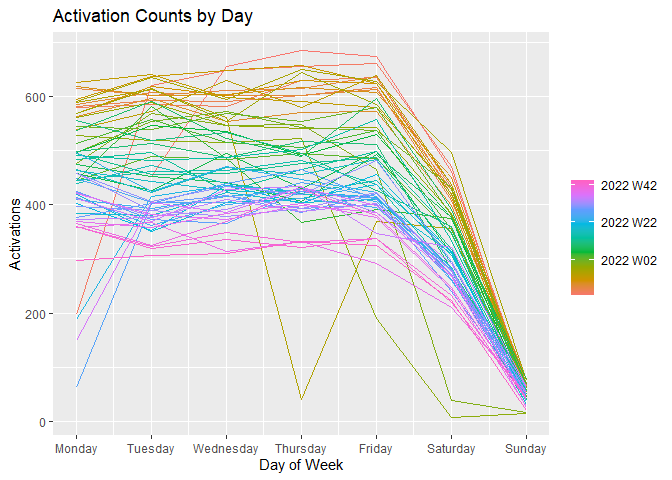
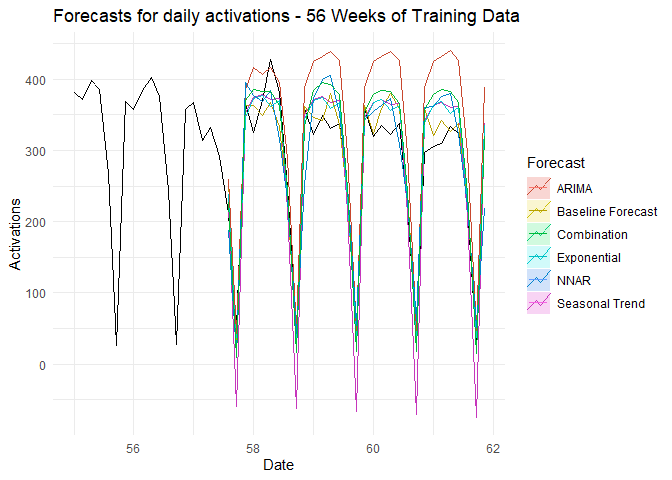
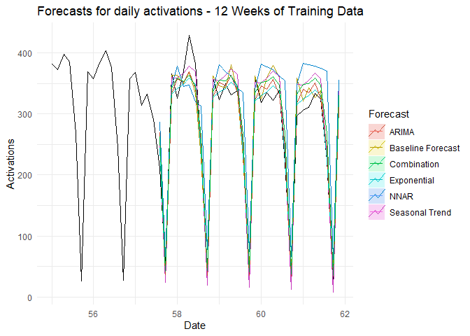

## EDA


```r
# Create Time Series Object
myts <- ts(df$activation_count, 
           start = c(2021, as.numeric(format(df$date[1], "%j"))),
           frequency = 364)


autoplot(myts) +
  xlab("Date") + 
  ylab("Activations") +
  ggtitle("Forecasts for daily activations") +
  theme_minimal() +
  guides(colour=guide_legend(title="Forecast"))
```

<!-- -->


```r
temp <- df %>% 
  mutate(svc_agreement_activation_date = as.Date(svc_agreement_activation_date)) %>% 
  as_tsibble(., index = svc_agreement_activation_date)

temp %>% 
  gg_season(activation_count, period = "week") +
  theme(legend.position = "right") +
  labs(y="Activations", x="Day of Week", title="Activation Counts by Day")
```

<!-- -->


```r
library(forecast)

myts <- ts(df$activation_count, 
           start = c(1, 1),
           frequency = 7)

# Split Data
train <- window(myts, end = c(57, 4)) #273 orig 300
valid <- window(myts, start = c(57, 5)) # October of 2022

# Set Forecast periods
h <- length(valid)


#############
# Train Models
# Trend + Seasonal Model
ST <- forecast::forecast(forecast::tslm(train ~ trend + season),h=h)

# Exponential Model
EXP <- forecast::forecast(forecast::tslm(train ~ trend + season, lambda = 0),h=h)

# NNAR - Autofit neural network
NNAR <- forecast::forecast(nnetar(train), h=h)#, lambda=0)


# Auto ARIMA
ARIMA <- forecast::forecast(auto.arima(train, lambda=0, biasadj=TRUE),h=h)


# Ensemble Approach
Combination <- (EXP[["mean"]] + 
                  ARIMA[["mean"]] +
                  ST[["mean"]] + 
                  NNAR[["mean"]])/4
```


```r
############
# Baseline Naïve Model

naive_df <- df %>% 
  mutate(naive_forecast = (lag7 + lag14)/2) %>% 
  select(svc_agreement_activation_date, naive_forecast, activation_count)


# Create Time Series Object
mynaivets <- ts(naive_df$naive_forecast, 
                start = c(1,1),
                frequency = 7)

# Plot Results
autoplot(window(myts, start=c(55, 1))) +
  autolayer(window(mynaivets, start=c(57, 5)), series="Baseline Forecast") +
  autolayer(ST, series="Seasonal Trend", PI=FALSE) +
  autolayer(EXP, series="Exponential", PI=FALSE) +
  autolayer(ARIMA, series="ARIMA", PI=FALSE) +
  autolayer(NNAR, series="NNAR", PI=FALSE) +
  autolayer(Combination, series="Combination") +
  xlab("Date") + 
  ylab("Activations") +
  ggtitle("Forecasts for daily activations - 56 Weeks of Training Data") +
  theme_minimal() +
  guides(colour=guide_legend(title="Forecast"))
```

<!-- -->

## Including Plots

```r
# Baseline model

resids <- naive_df %>% 
  filter(svc_agreement_activation_date >= as.Date('2022-10-01')) %>% 
  mutate(residuals = naive_forecast - activation_count) %>% 
  select(residuals)

# RMSE
print("Baseline Forecast")
```

```
## [1] "Baseline Forecast"
```

```r
print("RMSE - Test Set")
```

```
## [1] "RMSE - Test Set"
```

```r
round(sqrt(mean(resids$residuals^2)),2)
```

```
## [1] 28.16
```

```r
print("")
```

```
## [1] ""
```

```r
print(strrep("#", 80))
```

```
## [1] "################################################################################"
```

```r
print("Seasonal Trend")
```

```
## [1] "Seasonal Trend"
```

```r
round(forecast::accuracy(ST, valid),2)
```

```
##                ME  RMSE   MAE    MPE  MAPE MASE ACF1 Theil's U
## Training set 0.00 67.21 41.80 -19.71 42.10 0.95  0.3        NA
## Test set     3.22 53.06 42.06  42.51 54.68 0.96  0.2      0.08
```

```r
print("")
```

```
## [1] ""
```

```r
print(strrep("#", 80))
```

```
## [1] "################################################################################"
```

```r
print("Exponential")
```

```
## [1] "Exponential"
```

```r
round(forecast::accuracy(EXP, valid),2)
```

```
##                  ME  RMSE   MAE    MPE  MAPE MASE ACF1 Theil's U
## Training set  11.00 64.59 39.37 -16.10 28.59 0.89 0.31        NA
## Test set     -14.18 30.89 25.35  -5.65 12.20 0.58 0.29      0.06
```

```r
print("")
```

```
## [1] ""
```

```r
print(strrep("#", 80))
```

```
## [1] "################################################################################"
```

```r
print("Neural Network")
```

```
## [1] "Neural Network"
```

```r
round(forecast::accuracy(NNAR, valid),2)
```

```
##                 ME  RMSE   MAE   MPE  MAPE MASE  ACF1 Theil's U
## Training set -0.08 12.43  8.24 -1.50  4.48 0.19 -0.04        NA
## Test set     -7.97 46.92 37.51 -7.38 20.25 0.85  0.19      0.31
```

```r
print("")    
```

```
## [1] ""
```

```r
print(strrep("#", 80))
```

```
## [1] "################################################################################"
```

```r
print("ARIMA")
```

```
## [1] "ARIMA"
```

```r
round(forecast::accuracy(ARIMA, valid),2)
```

```
##                  ME  RMSE   MAE    MPE  MAPE MASE  ACF1 Theil's U
## Training set -31.11 80.60 53.02 -23.73 29.49 1.20 -0.14        NA
## Test set     -62.31 74.87 63.58 -24.80 25.99 1.44  0.48      0.19
```

```r
print("")
```

```
## [1] ""
```

```r
print(strrep("#", 80))
```

```
## [1] "################################################################################"
```

```r
print("Combination")
```

```
## [1] "Combination"
```

```r
round(forecast::accuracy(Combination, valid),2)
```

```
##              ME  RMSE   MAE  MPE  MAPE ACF1 Theil's U
## Test set -20.31 41.32 35.07 1.17 18.94 0.44      0.08
```

```r
print("")
```

```
## [1] ""
```

You can also embed plots, for example:


```r
c(
  Baseline = round(sqrt(mean(resids$residuals^2)),2),
  ST = forecast::accuracy(ST, valid)["Test set","RMSE"],
  EXP = forecast::accuracy(EXP, valid)["Test set","RMSE"],
  NNAR = forecast::accuracy(NNAR, valid)["Test set","RMSE"],
  ARIMA = forecast::accuracy(ARIMA, valid)["Test set","RMSE"],
  Combination = forecast::accuracy(Combination, valid)["Test set","RMSE"])
```

```
##    Baseline          ST         EXP        NNAR       ARIMA Combination 
##    28.16000    53.05689    30.88719    46.91997    74.87482    41.31594
```

Let's try adding the Baseline Forecast to the ensemble to see if we get an improvement in our prediction.


```r
baseline.predict <- df %>% 
  select(svc_agreement_activation_date, activation_count, lag7, lag14) %>% 
  mutate(naive_forecast = (lag7 + lag14)/2) %>% 
  filter(svc_agreement_activation_date >= as.Date('2022-10-01')) 


NewCombination <- (EXP[["mean"]] + 
                  ARIMA[["mean"]] +
                  ST[["mean"]] + 
                  NNAR[["mean"]] + 
                  baseline.predict[["naive_forecast"]])/5

round(forecast::accuracy(NewCombination, valid),2)
```

```
##              ME  RMSE   MAE   MPE MAPE ACF1 Theil's U
## Test set -17.82 37.16 31.28 -0.11   16 0.42      0.08
```

# Try Shorter Lookback Windows
Seeing that the better performing model uses a smaller lookback period I want to try the same models with a smaller look back period.


```r
library(forecast)

myts <- ts(df$activation_count, 
           start = c(1, 1),
           frequency = 7)

# Split Data
train <- window(myts, start = c(45, 5), end = c(57, 4)) #273 orig 300
valid <- window(myts, start = c(57, 5)) # October of 2022

# Set Forecast periods
h <- length(valid)


#############
# Train Models
# Trend + Seasonal Model
ST <- forecast::forecast(forecast::tslm(train ~ trend + season),h=h)

# Exponential Model
EXP <- forecast::forecast(forecast::tslm(train ~ trend + season, lambda = 0),h=h)

# NNAR - Autofit neural network
NNAR <- forecast::forecast(nnetar(train), h=h)#, lambda=0)


# Auto ARIMA
ARIMA <- forecast::forecast(auto.arima(train, lambda=0, biasadj=TRUE),h=h)


# Ensemble Approach
Combination <- (EXP[["mean"]] + 
                  ARIMA[["mean"]] +
                  ST[["mean"]] + 
                  NNAR[["mean"]])/4
```


```r
############
# Baseline Naïve Model

naive_df <- df %>% 
  mutate(naive_forecast = (lag7 + lag14)/2) %>% 
  select(svc_agreement_activation_date, naive_forecast, activation_count)


# Create Time Series Object
mynaivets <- ts(naive_df$naive_forecast, 
                start = c(1,1),
                frequency = 7)

# Plot Results
autoplot(window(myts, start=c(55, 1))) +
  autolayer(window(mynaivets, start=c(57, 5)), series="Baseline Forecast") +
  autolayer(ST, series="Seasonal Trend", PI=FALSE) +
  autolayer(EXP, series="Exponential", PI=FALSE) +
  autolayer(ARIMA, series="ARIMA", PI=FALSE) +
  autolayer(NNAR, series="NNAR", PI=FALSE) +
  autolayer(Combination, series="Combination") +
  xlab("Date") + 
  ylab("Activations") +
  ggtitle("Forecasts for daily activations - 12 Weeks of Training Data") +
  theme_minimal() +
  guides(colour=guide_legend(title="Forecast"))
```

<!-- -->

## Including Plots

```r
# Baseline model

resids <- naive_df %>% 
  filter(svc_agreement_activation_date >= as.Date('2022-10-01')) %>% 
  mutate(residuals = naive_forecast - activation_count) %>% 
  select(residuals)

# RMSE
print("Baseline Forecast")
```

```
## [1] "Baseline Forecast"
```

```r
print("RMSE - Test Set")
```

```
## [1] "RMSE - Test Set"
```

```r
round(sqrt(mean(resids$residuals^2)),2)
```

```
## [1] 28.16
```

```r
print("")
```

```
## [1] ""
```

```r
print(strrep("#", 80))
```

```
## [1] "################################################################################"
```

```r
print("Seasonal Trend")
```

```
## [1] "Seasonal Trend"
```

```r
round(forecast::accuracy(ST, valid),2)
```

```
##                  ME  RMSE   MAE   MPE  MAPE MASE  ACF1 Theil's U
## Training set   0.00 36.40 21.89 -1.99  9.45 0.68 -0.03        NA
## Test set     -11.71 28.84 24.92  4.24 16.38 0.78  0.26      0.07
```

```r
print("")
```

```
## [1] ""
```

```r
print(strrep("#", 80))
```

```
## [1] "################################################################################"
```

```r
print("Exponential")
```

```
## [1] "Exponential"
```

```r
round(forecast::accuracy(EXP, valid),2)
```

```
##                ME  RMSE   MAE   MPE  MAPE MASE ACF1 Theil's U
## Training set 2.26 37.25 24.90 -1.45 10.57 0.78 0.02        NA
## Test set     1.81 22.01 16.48 -1.95  8.90 0.51 0.17      0.09
```

```r
print("")
```

```
## [1] ""
```

```r
print(strrep("#", 80))
```

```
## [1] "################################################################################"
```

```r
print("Neural Network")
```

```
## [1] "Neural Network"
```

```r
round(forecast::accuracy(NNAR, valid),2)
```

```
##                  ME  RMSE   MAE    MPE  MAPE MASE ACF1 Theil's U
## Training set  -0.01 35.55 23.24  -3.31 11.19 0.73 0.08        NA
## Test set     -35.75 59.87 50.21 -26.82 30.53 1.57 0.15       0.1
```

```r
print("")    
```

```
## [1] ""
```

```r
print(strrep("#", 80))
```

```
## [1] "################################################################################"
```

```r
print("ARIMA")
```

```
## [1] "ARIMA"
```

```r
round(forecast::accuracy(ARIMA, valid),2)
```

```
##                 ME  RMSE   MAE   MPE  MAPE MASE ACF1 Theil's U
## Training set  3.50 38.67 23.54 -2.31 10.73 0.73 0.20        NA
## Test set     -3.81 26.72 22.28 -1.97 11.64 0.70 0.01      0.08
```

```r
print("")
```

```
## [1] ""
```

```r
print(strrep("#", 80))
```

```
## [1] "################################################################################"
```

```r
print("Combination")
```

```
## [1] "Combination"
```

```r
round(forecast::accuracy(Combination, valid),2)
```

```
##              ME  RMSE   MAE   MPE  MAPE ACF1 Theil's U
## Test set -12.37 30.18 25.53 -6.63 11.85 0.19      0.06
```

```r
print("")
```

```
## [1] ""
```

You can also embed plots, for example:


```r
c(
  Baseline = round(sqrt(mean(resids$residuals^2)),2),
  ST = forecast::accuracy(ST, valid)["Test set","RMSE"],
  EXP = forecast::accuracy(EXP, valid)["Test set","RMSE"],
  NNAR = forecast::accuracy(NNAR, valid)["Test set","RMSE"],
  ARIMA = forecast::accuracy(ARIMA, valid)["Test set","RMSE"],
  Combination = forecast::accuracy(Combination, valid)["Test set","RMSE"])
```

```
##    Baseline          ST         EXP        NNAR       ARIMA Combination 
##    28.16000    28.83790    22.00725    59.87182    26.72047    30.18254
```

Let's try adding the Baseline Forecast to the ensemble to see if we get an improvement in our prediction.


```r
baseline.predict <- df %>% 
  select(svc_agreement_activation_date, activation_count, lag7, lag14) %>% 
  mutate(naive_forecast = (lag7 + lag14)/2) %>% 
  filter(svc_agreement_activation_date >= as.Date('2022-10-01')) 


NewCombination <- (EXP[["mean"]] + 
                  ARIMA[["mean"]] +
                  ST[["mean"]] + 
                  NNAR[["mean"]] + 
                  baseline.predict[["naive_forecast"]])/5

round(forecast::accuracy(NewCombination, valid),2)
```

```
##              ME  RMSE   MAE   MPE  MAPE ACF1 Theil's U
## Test set -11.46 28.71 23.97 -6.34 11.64 0.23      0.06
```
