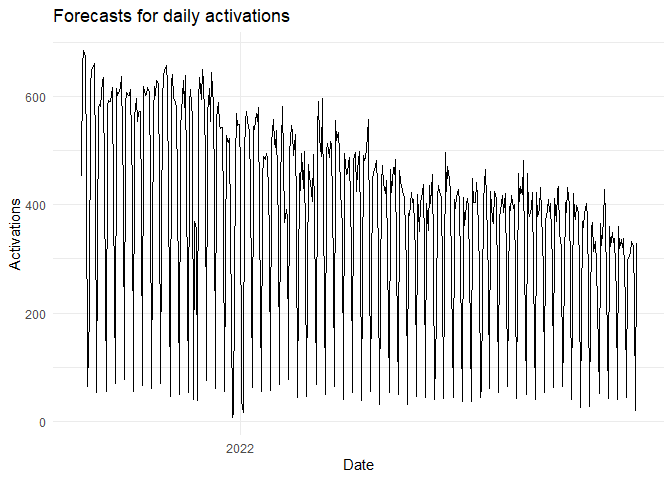
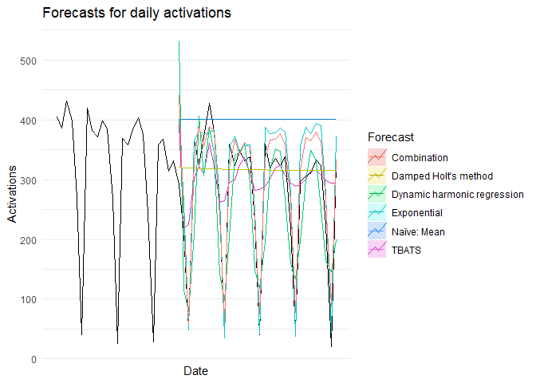

EDA
================
Zachariah Freitas
2022-12-04

## EDA

``` r
# Create Time Series Object
myts <- ts(df$activation_count, 
           start = c(2021, as.numeric(format(df$date[1], "%j"))),
           frequency = 364)


autoplot(myts) +
  xlab("Date") + 
  ylab("Activations") +
  ggtitle("Forecasts for daily activations") +
  theme_minimal() +
  guides(colour=guide_legend(title="Forecast"))
```

<!-- -->

``` r
# Split Data
train <- window(myts, end = c(2022, 273)) #273 orig 300

# Set Forecast periods
h <- length(myts) - length(train)

############
# Naïve Models
mean_fit <- meanf(train,h=h) # Naïve: Mean
naive_fit <- naive(train,h=h,level = 95) # Naïve: Last Value
drift_fit <- rwf(train,h=h,drift=TRUE) # Naïve: Drift Method
snaive_fit <- snaive(train,h=h) # Naïve: Seasonal Naïve

#############
# Train Models
# Trend + Seasonal Model
ST <- forecast(tslm(train ~ trend + season),h=h)
# Trend + Fourier Seasonal or Harmonic Regression Model
# fourier <- forecast(tslm(train ~ trend + fourier(train, K=2)),h=h)
# Exponential Model
EXP <- forecast(tslm(train ~ trend + season, lambda = 0),h=h)
# Spline Model
# SPLINE <- forecast(tslm(train ~ trend + I(trend^2) + I(trend^3) + season),h=h)
#TBats
TBATS <- forecast(tbats(train, biasadj=TRUE), h=h)
# NNAR - neural network
NNAR <- forecast(nnetar(train), h=h)#, lambda=0)
#STL
# STL <- stlf(train, lambda=0, h=h, biasadj=TRUE)
# Auto ARIMA
ARIMA <- forecast(auto.arima(train, lambda=0, biasadj=TRUE),h=h)
# ETS
ETS <- forecast(ets(train), h=h)
```

    ## Warning in ets(train): I can't handle data with frequency greater than 24.
    ## Seasonality will be ignored. Try stlf() if you need seasonal forecasts.

``` r
DHOLT <- holt(train, damped=TRUE, phi = 0.9, h=h)


# Dynamic harmonic regression
k = 1
fit <- auto.arima(train, xreg = fourier(train, K = k), seasonal = FALSE, lambda = 0)
model <- forecast(fit, xreg=fourier(train, K=k, h=h))

Combination <- (EXP[["mean"]] + 
                  ARIMA[["mean"]] +
                  ST[["mean"]] + 
                  NNAR[["mean"]] + 
                  TBATS[["mean"]])/5


# Combination <- (EXP[["mean"]] +  
#                   TBATS[["mean"]])/2

# Plot Results
autoplot(window(myts, start=c(2022, 250))) +
  autolayer(mean_fit, series="Naïve: Mean", PI=FALSE) +
  # autolayer(drift_fit, series="Naïve: Drift Method", PI=FALSE) +
  # autolayer(snaive_fit, series="Naïve: Seasonal Naïve", PI=FALSE) +
  # autolayer(naive_fit, series="Naïve: Last Value", PI=FALSE) +
  # autolayer(ST, series="Seasonal Trend", PI=FALSE) +
  autolayer(EXP, series="Exponential", PI=FALSE) +
  # autolayer(SPLINE, series="Spline", PI=FALSE) +
  # autolayer(ARIMA, series="ARIMA", PI=FALSE) +
  autolayer(TBATS, series="TBATS", PI=FALSE) +
  # autolayer(NNAR, series="NNAR", PI=FALSE) +
  # autolayer(ETS, series="ETS", PI=FALSE) +
  autolayer(DHOLT, series="Damped Holt's method", PI=FALSE) +
  autolayer(model, series="Dynamic harmonic regression", PI=FALSE) +
  autolayer(Combination, series="Combination") +
  xlab("Date") + 
  ylab("Activations") +
  ggtitle("Forecasts for daily activations") +
  theme_minimal() +
  guides(colour=guide_legend(title="Forecast"))
```

<!-- -->

## Including Plots

``` r
window_df <- window(myts, start=2021)
```

    ## Warning in window.default(x, ...): 'start' value not changed

``` r
print(strrep("#", 80))
```

    ## [1] "################################################################################"

``` r
print("Naïve: Mean")
```

    ## [1] "Naïve: Mean"

``` r
accuracy(mean_fit, window_df)
```

    ##                         ME     RMSE      MAE       MPE     MAPE      MASE
    ## Training set -1.000718e-14 176.8711 134.0549 -122.4167 146.4996 0.7081973
    ## Test set     -1.262506e+02 168.2421 127.9850 -184.1317 184.5369 0.6761305
    ##                    ACF1 Theil's U
    ## Training set 0.27719016        NA
    ## Test set     0.09946982 0.2870297

``` r
print(strrep("#", 80))
```

    ## [1] "################################################################################"

``` r
print("Naïve: Last Value")
```

    ## [1] "Naïve: Last Value"

``` r
accuracy(naive_fit, window_df)
```

    ##                       ME    RMSE      MAE        MPE     MAPE      MASE
    ## Training set  -0.3045685 212.885 144.1777  -85.03293 115.4957 0.7616748
    ## Test set     -58.0000000 125.420  77.0000 -135.68165 140.6510 0.4067825
    ##                     ACF1 Theil's U
    ## Training set -0.23720757        NA
    ## Test set      0.09946982 0.1598162

``` r
print(strrep("#", 80))
```

    ## [1] "################################################################################"

``` r
print("Naïve: Drift Method")
```

    ## [1] "Naïve: Drift Method"

``` r
accuracy(drift_fit, window_df)
```

    ##                         ME     RMSE       MAE        MPE     MAPE      MASE
    ## Training set  9.424673e-15 212.8848 144.14984  -84.86343 115.3973 0.7615278
    ## Test set     -5.297462e+01 122.9446  75.54569 -131.64194 137.6467 0.3990996
    ##                     ACF1 Theil's U
    ## Training set -0.23720757        NA
    ## Test set      0.09474607 0.1586875

``` r
print(strrep("#", 80))
```

    ## [1] "################################################################################"

``` r
print("Naïve: Seasonal Naïve")
```

    ## [1] "Naïve: Seasonal Naïve"

``` r
accuracy(snaive_fit, window_df)
```

    ##                     ME     RMSE      MAE       MPE     MAPE     MASE      ACF1
    ## Training set -189.2903 207.6076 189.2903 -61.80915 61.80915 1.000000 0.2580153
    ## Test set     -214.9688 233.4526 214.9688 -81.51360 81.51360 1.135656 0.1013610
    ##              Theil's U
    ## Training set        NA
    ## Test set     0.8476038

``` r
print(strrep("#", 80))
```

    ## [1] "################################################################################"

``` r
print("Seasonal Trend")
```

    ## [1] "Seasonal Trend"

``` r
accuracy(ST, window_df)
```

    ##                         ME     RMSE       MAE        MPE      MAPE       MASE
    ## Training set -2.181290e-15 16.89028  5.321029  0.8441268  4.721569 0.02811041
    ## Test set     -2.567843e+01 94.59340 79.636089 52.8606635 86.173377 0.42070872
    ##                   ACF1 Theil's U
    ## Training set 0.2580153        NA
    ## Test set     0.1013610 0.2424521

``` r
print(strrep("#", 80))
```

    ## [1] "################################################################################"

``` r
print("Exponential")
```

    ## [1] "Exponential"

``` r
accuracy(EXP, window_df)
```

    ##                        ME      RMSE       MAE         MPE       MAPE       MASE
    ## Training set   0.09310382  8.419138  2.407766  -0.0520003  0.8673283 0.01271996
    ## Test set     -32.23932575 46.090287 37.123560 -13.6813001 17.1077383 0.19611969
    ##                   ACF1 Theil's U
    ## Training set 0.1992672        NA
    ## Test set     0.3330458 0.1323739

``` r
print(strrep("#", 80))
```

    ## [1] "################################################################################"

``` r
# print("Spline")
# accuracy(spine_fit, window_df)
print(strrep("#", 80))
```

    ## [1] "################################################################################"

``` r
print("ARIMA")
```

    ## [1] "ARIMA"

``` r
accuracy(ARIMA, window_df)
```

    ##                     ME     RMSE       MAE       MPE     MAPE      MASE
    ## Training set -49.82041 182.2024 126.42072 -51.14112 69.27741 0.6678668
    ## Test set     -54.68717 112.0750  91.22974 -66.71737 78.85856 0.4819567
    ##                     ACF1 Theil's U
    ## Training set -0.07475423        NA
    ## Test set     -0.33447815 0.2523784

``` r
print(strrep("#", 80))
```

    ## [1] "################################################################################"

``` r
print("ETS")
```

    ## [1] "ETS"

``` r
accuracy(ETS, window_df)
```

    ##                     ME     RMSE       MAE       MPE     MAPE      MASE
    ## Training set -14.49009 168.3107 124.93204 -130.1270 151.8149 0.6600022
    ## Test set     -47.11749 120.7735  75.30516 -127.9563 135.5365 0.3978289
    ##                    ACF1 Theil's U
    ## Training set 0.17023386        NA
    ## Test set     0.09946982 0.1617737

You can also embed plots, for example:

``` r
c(
  `Naïve: Mean`= accuracy(mean_fit, myts)["Test set","RMSE"],
  `Naïve: Last Value`= accuracy(naive_fit, myts)["Test set","RMSE"],
  `Naïve: Drift Method`= accuracy(drift_fit, myts)["Test set","RMSE"],
  `Naïve: Seasonal Naïve`= accuracy(snaive_fit, myts)["Test set","RMSE"],
  DHR = accuracy(model, myts)["Test set","RMSE"],
  ETS = accuracy(ETS, myts)["Test set","RMSE"],
  ARIMA = accuracy(ARIMA, myts)["Test set","RMSE"],
  ST = accuracy(ST, myts)["Test set","RMSE"],
  NNAR = accuracy(NNAR, myts)["Test set","RMSE"],
  EXP = accuracy(EXP, myts)["Test set","RMSE"],
  TBATS = accuracy(TBATS, myts)["Test set","RMSE"],
  Combination = accuracy(Combination, myts)["Test set","RMSE"])
```

    ##           Naïve: Mean     Naïve: Last Value   Naïve: Drift Method 
    ##             168.24212             125.42004             122.94462 
    ## Naïve: Seasonal Naïve                   DHR                   ETS 
    ##             233.45255              89.72497             120.77353 
    ##                 ARIMA                    ST                  NNAR 
    ##             112.07496              94.59340              44.95554 
    ##                   EXP                 TBATS           Combination 
    ##              46.09029             101.01816              44.77530
